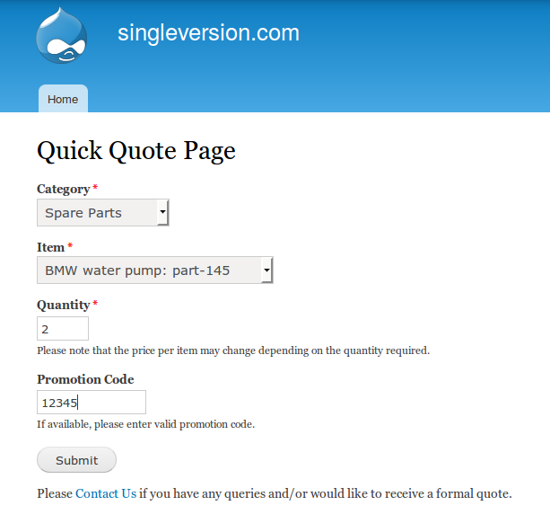
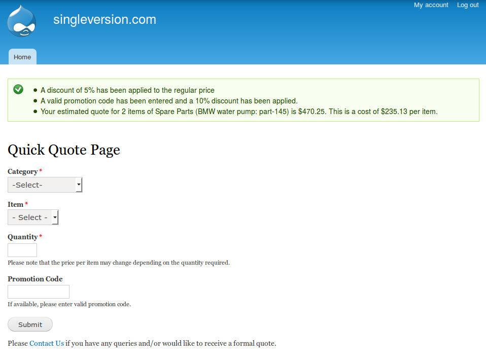
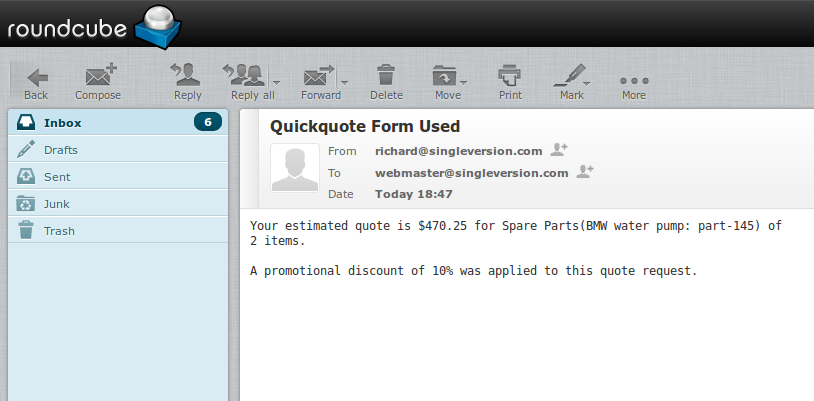

## quickquote
A custom Drupal 7 module that provides an instant price quote for a selected item.

Written in php using Drupal's Form API, this module provides a form page where a
category is selected, then an item under that category. The user will then enter
the number of items required and the screen will return an instant price quote,
along with the cost per item.

This instant quoting system is useful for small businesses who don't require a
full e-commerce solution. It was originally made for a company providing
laboratory services, but can also be used and adapted for other services and
products. It could also be used as an internal system to provide quick pricing
information for company employees.

## Features
- Ajax-powered dropdown selection for categories and items
- Built-in security and form validation from Drupal's Form API
- Highly customizable with ability to add as many categories and items as you like
- Ability to apply a flat handling fee for quantities below a certain size
- Ability to apply discounts to items for quantities of a certain size and/or
  within a certain range
- Ability to add a promotion code and set the percentage discount and expiry date
- Ability for a person to be notified by email each time a quote is performed,
  and which includes the specific details of each quote

## Screenshots

**quickquote input**  
  
**quickquote output**  
  
**quickquote email**    
  

## Installation
In your terminal, navigate to your Drupal 7 site's custom module directory (e.g.
~/public_html/sites/all/modules/custom). If custom doesn't already exist, just
create it. Then execute the following:
```
git clone https://github.com/rmcculloch/quickquote.git
```
Signed in as Admin on your Drupal site, and preferably when the site is in
administration mode, visit the Modules administration page and enable the
Quick Quote module (will be under the Custom section).

Visit the quickquote page of your site (e.g. http://mydomain.com/quickquote) and
check that the basic functionality of the module is working, i.e. you can select the
default categories/items, enter the quantity and submit the form and get a
result.

## Configuration
In your terminal, navigate into the quickquote directory and open the
quickquote.module file for editing. This is where you edit/enter all the information
relevant to your situation, i.e. categories, items, prices, surcharge amounts,
discounts, promotion codes and notification email. The file is well documented,
so it shouldn't be hard to determine where and how to make the appropriate
changes. It is recommended to check functionality of the module often when
making changes as minor errors will break the module/site until corrected.

## Legal
This repository principally exists for use by Single Version Pty Ltd.
Others are free to use it for any purpose they require. No warranties
are provided whatsoever; meaning you use quickquote totally at your
own risk.
